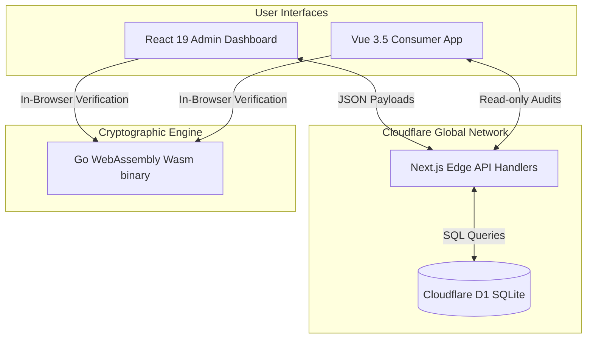
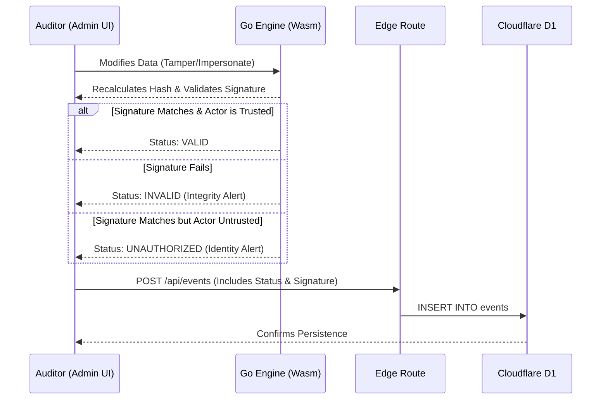

# 🌿 Eco-Trace: Radical ESG Traceability

> **High-Performance, Edge-Native Supply Chain Intelligence**

  

---

## 🎯 Project Vision

**Eco-Trace** is an industrial traceability ecosystem designed for radical transparency. We provide deterministic validation and ultra-low latency data delivery at the **Edge** to transform ESG (Environmental, Social, and Governance) metrics into verifiable digital assets. 

Built with enterprise governance in mind, it provides an immutable audit trail for carbon footprint tracking, eliminating greenwashing through cryptographic integrity.

---

## 🏗️ System Architecture & Data Flow

The architecture is distributed across a modern edge-compute paradigm, decoupling the cryptographic validation from the UI rendering layer.

### 1. Global Topology


### 2. Deterministic Validation Flow
Every event mutation undergoes strict Ed25519 verification before being allowed into the immutable ledger.


## 🚀 Detailed Tech Stack
This monorepo utilizes a high-performance, strictly typed stack designed for the modern web:

### Frontend / Client Layer
- **React 19:** Utilizing Server Components and Server Actions for the Admin Dashboard.
- **Vue 3.5 (Vapor Mode):** For the ultra-lightweight Consumer application.
- **Tailwind CSS v4:** Utility-first styling with `@eco-trace/ui` internal design system.
- **Lucide React/Vue:** Consistent iconography.

### Backend / Edge Layer
- **Next.js Route Handlers:** Running strictly on the Edge runtime.
- **Cloudflare D1:** Distributed serverless SQL database natively integrated at the edge.
- **Wrangler:** Local simulation and deployment pipeline for Cloudflare resources.

### Core Cryptography (The "Brain")
- **Go (Golang) v1.22+:** Compiling down to `.wasm` to handle Ed25519 public-key cryptography and strict hashing at near-native speeds directly in the browser.

### Tooling & Infrastructure
- **pnpm:** Workspaces for monorepo package management.
- **TypeScript 5.x:** End-to-end type safety.

## 🧠 Intelligence Infrastructure (.ai/)
Project governance resides in a decentralized intelligence layer that guides autonomous execution.
- **Context:** Active state and session memory management.
- **Rules:** Technical constitution enforcing Zero-Hallucination and Zero-Slop Commenting policies.
- **Library:** Versioned prompt library for mission-critical workflows and skill execution.

## ⚡ Mathematical & Security Pillars
- **Deterministic ESG Math:** All carbon footprint calculations strictly follow the immutable formula:
  $$CF_{total} = \sum_{i=1}^{n} (E_i \times EF_i)$$
- **Threaded Audit Trail:** Events are grouped chronologically by `event_id`, preserving an unalterable history of tampering attempts without cluttering the primary view.

## 🚦 Current Operational Status
**Current Phase:** Phase 4: Edge Persistence & Audit Trail Active
**Focus:** Core validation engine operational with deterministic ESG logic, live Ed25519 Cryptographic Gate (Wasm), and Trusted Actor Registry active on the React Admin UI. Engineered a Threaded High-Density Audit Trail grouping unique `event_id` flows natively backed by Cloudflare D1, equipped with Wasm Shadow Key Simulation for cryptographic impersonation testing.

> [!CAUTION]
> **Strict Governance:** Any changes to the "Bridge" infrastructure require a Staff-level technical audit and validation against EVALS.md test cases.

## 🛠️ Local Development Quick Start

### 1. Prerequisites
- **Node.js**: v22.x (LTS highly recommended)
- **Go**: v1.22+ (Required for Wasm cryptographic compilation)
- **Package Manager**: pnpm (`npm install -g pnpm`)

### 2. Installation
Clone the repository and install all workspace dependencies:
```bash
git clone git@github.com:h-builds/eco-trace.git
cd eco-trace
pnpm install
```

### 3. Engine Compilation (WebAssembly)
The Go Cryptographic Gate must be compiled to WebAssembly and injected into the Admin application's public directory.
```bash
cd packages/engine
./build.sh
cd ../..
```

### 4. Database Setup (Cloudflare D1)
Initialize the local SQLite Edge database, apply the schema, and seed it with cryptographically valid test pairs seamlessly linked to the Wasm engine:
```bash
cd apps/admin
# 1. Apply Schema
npx wrangler d1 execute eco-trace-events --local --file=./schema.sql
# 2. Generate Deterministic Key Pairs and Mock Data
npx tsx lib/seed.ts
# 3. Seed Database
npx wrangler d1 execute eco-trace-events --local --file=./seed.sql
```

### 5. Running the Edge Server
Boot the Next.js server equipped with the Wrangler proxy to simulate Edge compatibility locally:
```bash
# Still in apps/admin
pnpm run dev:edge
```
Access the High-Density Event Log at http://localhost:3001/dashboard/events.

> [!NOTE]
> Ensure the `pages_build_output_dir` parameter remains commented out (`# pages_build_output_dir`) in `apps/admin/wrangler.toml` during local development to prevent Wrangler proxy network collisions.

## 🤖 AI Agentic Workflow
If operating as an autonomous entity:
- Adopt the Operational Persona defined in AGENTS.md.
- Execute templates and capabilities continuously via LIBRARY.md.

Built for the Edge. Engineered for Trust. Managed from South America.
