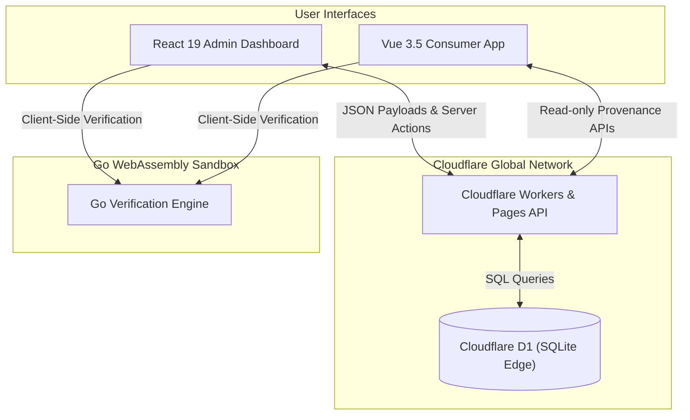
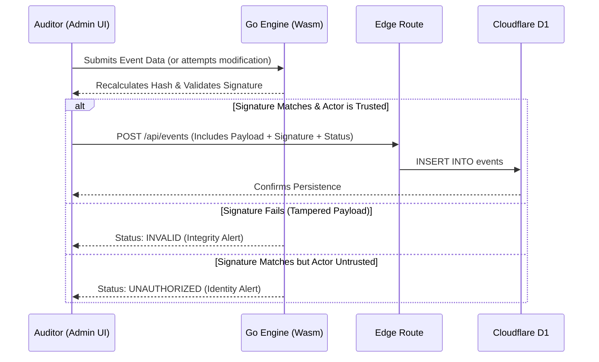

# 🌿 Eco Trace — Enterprise Verification Architecture Demo

> **Verifiable enterprise workflows for supply-chain claims.**

  

---

## Executive Positioning

Eco Trace is a **collaborative enterprise verification architecture demo** built to show how modern engineering teams can make supply-chain sustainability claims trustworthy, auditable, and consumer-verifiable using **React 19, Vue 3.5 Vapor, Go/WebAssembly, Cloudflare D1**, and deterministic governance.

In 2026, the hard problem is not generating another interface. The hard problem is making enterprise data trustworthy, verifiable, governable, and usable across different actors. Eco Trace demonstrates how to solve this challenge through a role-specific, cryptographically verified supply-chain architecture.

> [!NOTE]
> ### What Eco Trace Is
> - A portfolio-grade architecture showcase.
> - A two-app ecosystem: **Admin Workstation** (React 19) + **Consumer Verification App** (Vue 3.5 Vapor).
> - A proof of engineering judgment across frontend frameworks, edge computing, cryptography, and UX.
> - A recruiter-friendly technical case study.

> [!WARNING]
> ### What Eco Trace Is Not
> - **Not a production ESG compliance company.**
> - **Not a blockchain project.**
> - **Not a SaaS billing or multi-tenant product.**
> - **Not an AI wrapper.**
> - **Not a claim of real ISO certification, real customers, or real enterprise deployment.** All metrics, certifications, and compliance logs shown in the app are seeded for demo purposes.

---

## Live Demo Links

Experience the live deployments running on Cloudflare's Edge Network:

*   🌐 **[Unified Demo Hub Entry Point](https://eco-trace-hub.achegideas.workers.dev/)** — The central landing page explaining the ecosystem and routing users.
*   🖥️ **[Auditor Workstation (Admin App)](https://eco-trace-admin.pages.dev/)** — Secure, authenticated dashboard for managing entities and inspecting supply chain integrity.
*   📱 **[Consumer Verification App](https://eco-trace-consumer.achegideas.workers.dev/?asset=ASSET-COFFEE-2026-001)** — High-performance scanner and product transparency viewer (pre-loaded with the demo asset).
*   📖 **[Technical Case Study](file:///home/hguerra/eco-trace/docs/case-study.md)** — Architectural write-up detailing business problems, trade-offs, and verification methodologies.

---

## Guided Recruiter Journeys

To evaluate the system quickly, choose one of the following structured paths:

### 1. Fast Recruiter Path (2 to 3 Minutes)
1. **Start at the Hub**: Open the [Unified Demo Hub](https://eco-trace-hub.achegideas.workers.dev/).
2. **Audit the Claim**: Click **Audit the Claim** to go to the Auditor Workstation login. Click the **Use Demo Auditor** button to automatically pre-fill credentials, and sign in.
3. **Verify Integrity**: Go to **Integrity Events** in the sidebar. Look at `ASSET-COFFEE-2026-001`. Expand **Event 4 (INVALID)** to see how the system flags a retroactively tampered carbon payload, and **Event 5 (UNAUTHORIZED)** to see an unregistered supplier key block.
4. **Open Consumer View**: Go to **Compliance Export**, select the coffee asset, and click the **View in Consumer App** link.
5. **Review Provenance**: On the Consumer transparency page, see the green **Authenticity Badge** and the detailed carbon footprint calculation calculated by Go/WebAssembly.

### 2. Technical Reviewer Path (7 to 10 Minutes)
1. **Inspect Trust boundaries**: Read the [Case Study](file:///home/hguerra/eco-trace/docs/case-study.md) explaining how the Go/Wasm sandbox isolates cryptographic operations from browser-based XSS.
2. **Verify Edge RBAC**: Check the Next.js Middleware configuration that protects `/dashboard/*` routes and verifies session tokens stored in Cloudflare KV at the edge.
3. **Examine Vue 3.5 Vapor**: Review the Consumer codebase to see compile-time reactive signals rendering raw DOM nodes without virtual-DOM overhead.
4. **Export Compliance Evidence**: Go to `/dashboard/compliance` and download the client-side generated PDF containing Ed25519 signatures and public keys to verify offline auditable evidence.
5. **Run Local Validation**: Follow the local commands below to verify that the entire test suite and compiler gates pass.

---

## Why Two Applications?

Eco Trace separates user interfaces into two distinct applications to match the access control, runtime, and latency requirements of different surfaces:

| Surface | Stack | Purpose |
| :--- | :--- | :--- |
| **Admin Workstation** | React 19, Next.js (App Router), Cloudflare Pages | **Internal Auditor Workspace:** Write-heavy, authenticated, governed by Next.js Middleware RBAC. Features RSC data streaming and Server Actions targeting D1. |
| **Consumer App** | Vue 3.5 Vapor Mode, Vite, Workers Native Static Assets | **Public Verification Surface:** Read-only, unauthenticated, mobile-first scanner. Vapor mode eliminates virtual-DOM overhead to achieve sub-100ms loading speeds. |
| **Shared Engine** | Go 1.22+, WebAssembly (Go/Wasm) | **Shared Trust boundary:** Executes identical Ed25519 signature checks and deterministic carbon calculations inside a browser WebWorker sandbox on both platforms. |

---

## System Architecture


```mermaid
graph TD
    subgraph Edge Network [Cloudflare Global Network]
        API["Cloudflare Workers & Pages API"]
        DB[("Cloudflare D1 (SQLite Edge)")]
    end

    subgraph User Interfaces
        Admin[React 19 Admin Dashboard]
        Consumer[Vue 3.5 Consumer App]
    end

    subgraph Cryptographic Engine [Go WebAssembly Sandbox]
        Wasm[Go Verification Engine]
    end

    Admin <-->|JSON Payloads & Server Actions| API
    Consumer <-->|Read-only Provenance APIs| API
    API <-->|SQL Queries| DB
    
    Admin -->|Client-Side Verification| Wasm
    Consumer -->|Client-Side Verification| Wasm
```

### Deterministic Validation Flow

Every supply chain event undergoes cryptographic verification using Ed25519 keys prior to database persistence and client presentation:


```mermaid
sequenceDiagram
    participant User as Auditor (Admin UI)
    participant Wasm as Go Engine (Wasm)
    participant API as Edge Route
    participant D1 as Cloudflare D1

    User->>Wasm: Submits Event Data (or attempts modification)
    Wasm-->>User: Recalculates Hash & Validates Signature
    alt Signature Matches & Actor is Trusted
        User->>API: POST /api/events (Includes Payload + Signature + Status)
        API->>D1: INSERT INTO events
        D1-->>User: Confirms Persistence
    else Signature Fails (Tampered Payload)
        Wasm-->>User: Status: INVALID (Integrity Alert)
    else Signature Matches but Actor Untrusted
        Wasm-->>User: Status: UNAUTHORIZED (Identity Alert)
    end
```

---

## Implemented Features

### Admin Workstation (React 19)
- **Edge Authentication**: Session state managed via Next.js Middleware and Cloudflare Workers KV.
- **Granular RBAC**: Role gates enforcing routes and mutations for `ADMIN`, `AUDITOR`, and `VIEWER` roles.
- **Streaming Overview Analytics**: PROGRESSIVE loading of dashboard counters via React Server Components (RSC) and Suspense boundaries.
- **Entity Management**: Onboard trusted suppliers, register trackable SKUs, and associate Ed25519 public keys.
- **Wasm-Backed Verification Log**: Visual audit trail demonstrating interactive tamper and unauthorized key testing.
- **Evidence Export**: Client-side generated compliance PDFs and CSV extracts carrying raw signatures and keys.
- **Unified Navigation**: Guided demo stepper providing recruiters with step-by-step UI assistance.

### Consumer Verification App (Vue 3.5 Vapor)
- **Vapor Rendering**: Zero virtual-DOM overhead compiled to vanilla JS for lightning-fast mobile loading.
- **QR Scanner**: Direct HTML5 camera scanner running in a separate WebWorker thread.
- **No-Camera Fallback**: A "Use Demo Product" bypass button enabling instant evaluation on any device.
- **SWR Data Hydration**: Reactive composables fetching read-only event histories from edge endpoints.
- **Product Transparency Screen**: Green authenticity badge, plain-English carbon formula breakdowns, and a chronological history timeline.

### Go/Wasm Cryptographic Engine
- **Deterministic Math**: Precision aggregation of carbon calculations ($CF_{total} = \sum E_i \times EF_i$).
- **Signature Security**: Ed25519 verification using internal registry public keys.
- **Sandboxed Execution**: Isolated JS bridge allowing standard browser worker scripts to interact with compiled Go binaries.

---

## Canonical Demo Scenario: Verified Product Journey

All live and local demo scenarios revolve around a single, pre-seeded supply chain flow:

| Element | Seeded Value |
| :--- | :--- |
| **Asset ID** | `ASSET-COFFEE-2026-001` (Andes Trace Coffee Lot 001) |
| **Trusted Supplier** | Andes Organic Cooperative (Harvest Origin) |
| **Processing Node** | Veridian Processing Node (Milling/Packaging) |
| **Logistics Actor** | NorthStar Logistics (Global Freight) |
| **Demo Auditor** | Eco Trace Demo Auditor (Final Inspection) |

### Seeded Anomalies (For Testing Verification)
- **Event 4 (INVALID)**: Veridian Processing Node attempts to modify the carbon emissions payload retroactively. The signature verification fails.
- **Event 5 (UNAUTHORIZED)**: An unrecognized transporter logs a delivery event using an intact Ed25519 signature from a key not listed in the Go registry.

---

## Local Development Quick Start

### 1. Prerequisites
- **Node.js**: v22.x (LTS)
- **Go**: v1.22+ (required to compile Go to WebAssembly)
- **pnpm**: `npm install -g pnpm`

### 2. Installation
```bash
git clone git@github.com:h-builds/eco-trace.git
cd eco-trace
pnpm install
```

### 3. Engine Compilation (Go/WebAssembly)
Build the Go cryptography engine and copy the binary to the static assets:
```bash
cd packages/engine
./build.sh
cd ../..
```

### 4. Database Setup & Seeding (Cloudflare D1)
Initialize the local SQLite simulation database and seed it with the demo scenario:
```bash
cd apps/admin
# Create schema
npx wrangler d1 execute eco-trace-events --local --file=./schema.sql
# Generate actor key pairs and seed SQL
npx tsx lib/seed.ts
# Seed the database
npx wrangler d1 execute eco-trace-events --local --file=./seed.sql
cd ../..
```

### 5. Running the Applications
Start all dev servers concurrently from the monorepo root:
```bash
pnpm dev
```
Individual ports are mapped as:
- **Demo Hub**: [http://localhost:5173](http://localhost:5173) (or `5174` depending on port availability)
- **Consumer App**: [http://localhost:5173](http://localhost:5173)
- **Admin Workstation (Edge Proxy)**: [http://localhost:8788](http://localhost:8788) (Run `pnpm --filter admin run dev:edge` within `apps/admin`)

---

## Validation & Test Commands

Maintain codebase health by executing the verification suite:

```bash
# Build all workspaces
pnpm build

# Run all vitest unit/integration tests
pnpm test

# Lint the monorepo
pnpm lint
```

### Go Engine Unit Tests
```bash
cd packages/engine
go test -v ./...
```

---

## Intelligence Infrastructure (.ai/)

Project governance and system context are stored in a structured workspace intelligence layer:
- **Context**: Active state history and session memory ([CONTEXT.md](file:///home/hguerra/eco-trace/.ai/context/CONTEXT.md)).
- **Rules**: Strict engineering guidelines, zero-hallucination policies, and commenting rules ([rules/](file:///home/hguerra/eco-trace/.ai/rules)).
- **Knowledge**: System architecture specifications, evaluation gates, and data dictionaries ([knowledge/](file:///home/hguerra/eco-trace/.ai/knowledge)).
- **Prompts**: Versioned system instructions for agent workflows ([prompts/](file:///home/hguerra/eco-trace/.ai/prompts)).

---

## Future Scope (Conceptual Roadmap)

The following capabilities are architecturally designed but **not implemented** in the current demo:

- 📶 **PWA / Offline Support**: Service worker caching for auditors logging events in rural farms with poor connectivity.
- 🌍 **Dynamic Locales (i18n)**: Translation mapping for global logistics and farming cooperatives.
- 📡 **Live IoT Cold Chain Telemetry**: Continuous streaming of GPS and temperature sensor data rather than static D1 snapshots.
- 🔌 **Enterprise ERP Connectors**: Direct outbound webhooks sending verified logs to SAP or Oracle NetSuite.

---

## Collaborator Credits

Designed and engineered for portfolios, edge execution, and technical reviews:

*   **[h-builds](https://github.com/h-builds)** — Lead Solutions Architect & Admin Workstation Engineer
*   **[LuismGil](https://github.com/LuismGil)** — Lead Consumer Verification App Engineer
*   **Antigravity** — Google DeepMind Agentic AI Coding Assistant
