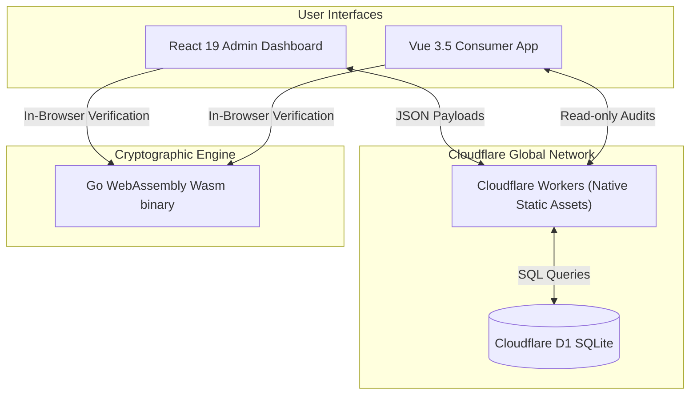
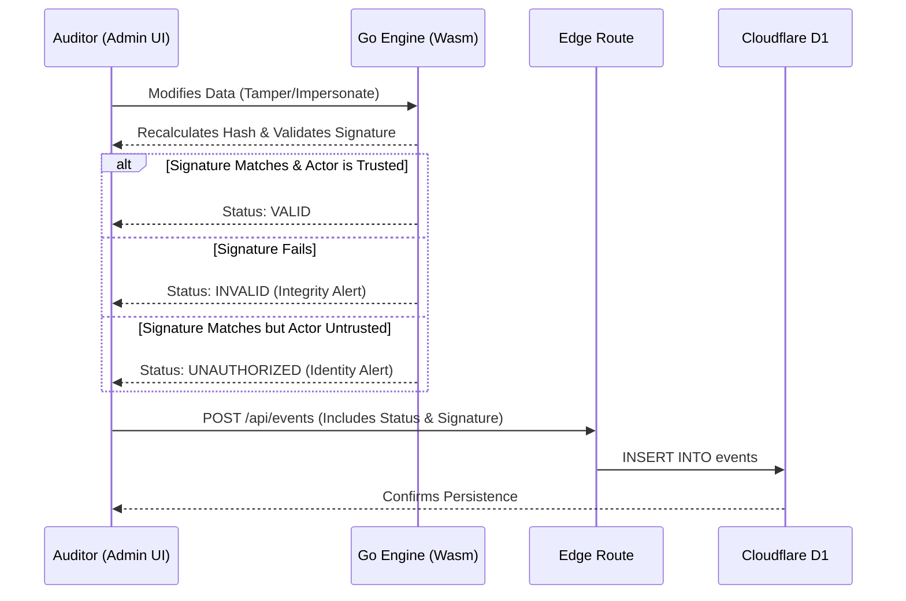

# 🌿 Eco Trace — Enterprise Verification Architecture Demo

> **Verifiable enterprise workflows for supply-chain claims.**

  

---

## What is Eco Trace?

Eco Trace is a **collaborative enterprise verification architecture demo** that turns supply-chain sustainability claims into cryptographically verifiable, audit-ready product histories.

It demonstrates how a modern engineering team can design trustworthy, auditable workflows across distributed supply-chain actors using role-specific interfaces, cryptographic validation, edge-native persistence, deterministic carbon-footprint logic, compliance-style reporting, a shared design system, and a collaborative multi-application architecture.

### What Eco Trace Is

- A portfolio-grade architecture demo.
- A two-app ecosystem: **Admin Workstation** (React 19) + **Consumer Verification App** (Vue 3.5 Vapor).
- A proof of engineering judgment across frontend, edge, cryptography, governance, and UX.
- A recruiter-friendly technical case study.

### What Eco Trace Is Not

- Not a production ESG compliance company.
- Not a blockchain project.
- Not a SaaS billing product.
- Not an AI wrapper.
- Not a claim of real ISO certification, real customers, or real enterprise deployment.

---

## Why Two Applications?

Eco Trace has two separate applications because it demonstrates two different enterprise surfaces:

| Surface | App | Technology | Purpose |
|---------|-----|-----------|---------|
| Internal Auditor | Admin Workstation | React 19, Server Components, Next.js Edge | Governance, RBAC, actor/asset control, integrity violations, compliance exports |
| External Consumer | Consumer Verification | Vue 3.5 Vapor, Vite | QR-driven verification, read-only transparency, mobile-first trust |
| Shared Trust Layer | Go/Wasm Engine | Go 1.22+, WebAssembly | Deterministic calculation, Ed25519 signing/verification, shared across both apps |

---

## System Architecture


```mermaid
graph TD
    subgraph Edge Network [Cloudflare Global Network]
        API["Cloudflare Workers (Native Static Assets)"]
        DB[("Cloudflare D1 SQLite")]
    end

    subgraph User Interfaces
        Admin[React 19 Admin Dashboard]
        Consumer[Vue 3.5 Consumer App]
    end

    subgraph Cryptographic Engine
        Wasm[Go WebAssembly Wasm binary]
    end

    Admin <-->|JSON Payloads| API
    Consumer <-->|Read-only Audits| API
    API <-->|SQL Queries| DB
    
    Admin -->|In-Browser Verification| Wasm
    Consumer -->|In-Browser Verification| Wasm
```

### Deterministic Validation Flow

Every event undergoes strict Ed25519 verification before persistence:


```mermaid
sequenceDiagram
    participant User as Auditor (Admin UI)
    participant Wasm as Go Engine (Wasm)
    participant API as Edge Route
    participant D1 as Cloudflare D1

    User->>Wasm: Modifies Data (Tamper/Impersonate)
    Wasm-->>User: Recalculates Hash & Validates Signature
    alt Signature Matches & Actor is Trusted
        Wasm-->>User: Status: VALID
    else Signature Fails
        Wasm-->>User: Status: INVALID (Integrity Alert)
    else Signature Matches but Actor Untrusted
        Wasm-->>User: Status: UNAUTHORIZED (Identity Alert)
    end
    User->>API: POST /api/events (Includes Status & Signature)
    API->>D1: INSERT INTO events
    D1-->>User: Confirms Persistence
```

---

## Implemented Features

### Admin Workstation (React 19)

- Auditor login flow with Edge-compatible session tokens (Cloudflare Workers KV).
- RBAC roles: `ADMIN`, `AUDITOR`, `VIEWER` with middleware-enforced route protection.
- Audit logging for all authentication events.
- `/dashboard/overview` — Macro analytics with React Server Components, Suspense streaming, time-range filters.
- `/dashboard/entities` — Trusted Actor onboarding, Asset registration, search, pagination.
- `/dashboard/events` — Threaded audit trail grouped by `event_id`, Wasm-backed integrity verification, tamper/impersonation testing.
- `/dashboard/compliance` — PDF and CSV compliance export with date-range and actor filters, immutable verified values.

### Consumer Verification App (Vue 3.5 Vapor)

- Vue 3.5 + Vite with Vapor-mode-oriented rendering.
- Read-only Wasm bridge: `VerifySignature` + `CalculateCarbonFootprint`.
- Native QR scanner with camera permission handling.
- Product Transparency View: Authenticity Badge, Carbon Formula, Audit Trail Timeline.
- SWR-style event hydration with typed API client.
- Industrial Editorial landing page (Precision Blueprint design system).
- Mobile-first responsive layout.

### Go/Wasm Engine

- Deterministic carbon-footprint calculation: $CF_{total} = \sum_{i=1}^{n} (E_i \times EF_i)$
- Ed25519 signing and verification.
- Trusted Actor Registry with unauthorized actor detection.
- Wasm bridge for both frontend applications.

### Shared Infrastructure

- `@eco-trace/ui` design tokens (colors, spacing, typography, radii, shadows).
- Data dictionary (`DATA_DICTIONARY.md`).
- Evaluation framework with 10 golden test cases.
- Governance rules (Zero-Slop Commenting, UI Dependency First, Mobile-First).

---

## Demo Scenario: Verified Product Journey

All demo work revolves around one clear scenario with deterministic seeded data:

| Element | Value |
|---------|-------|
| Asset ID | `ASSET-COFFEE-2026-001` |
| Product | Andes Trace Coffee Lot 001 |
| Supplier | Andes Organic Cooperative |
| Processor | Veridian Processing Node |
| Logistics | NorthStar Logistics |

The scenario includes valid supply-chain events (ORIGIN → TRANSFORM → TRANSPORT → AUDIT), a tampered event (`INVALID`), and an unauthorized actor event (`UNAUTHORIZED`).

> [!NOTE]
> All demo data is seeded and clearly labeled. No claim of real customers, certifications, or production deployment.

---

## Current Operational Status

**Phase 8 — Portfolio Demo Excellence**

All core functionality (Phases 1–7) is implemented and archived. Phase 8 is additive: demo polish, recruiter journey, truth alignment, cross-app contracts, and documentation.

Active task files:

| File | Scope |
|------|-------|
| `PLAN.md` | Source of truth for Phase 8 roadmap |
| `TASKS.md` | Root-level cross-cutting deliverables |
| `apps/admin/TASKS.md` | Admin Workstation demo polish |
| `apps/consumer/TASKS.md` | Consumer Verification demo polish |
| `apps/admin/archive/TASKS.md` | Phases 1–4 (archived, all complete) |
| `apps/consumer/archive/TASKS.md` | Phases 1–6 (archived, all complete) |

All task files use a shared **execution order (1)–(11)** so work can be coordinated across apps.

> [!CAUTION]
> **Strict Governance:** Any changes to the Go/Wasm engine or cryptographic bridge require validation against `EVALS.md` golden test cases.

---

## Tech Stack

### Frontend / Client Layer
- **React 19:** Server Components and Server Actions for the Admin Dashboard.
- **Vue 3.5 (Vapor Mode):** Ultra-lightweight Consumer application.
- **`@eco-trace/ui`:** Internal design system with shared tokens.
- **Lucide React/Vue:** Consistent iconography.

### Backend / Edge Layer
- **Cloudflare Workers (Native Static Assets):** Unified deployment for React (Admin), Vue (Consumer), and Vanilla TS (Hub).
- **Cloudflare D1:** Distributed serverless SQL database at the edge.
- **Wrangler:** Local simulation and deployment for Cloudflare resources.

### Core Cryptography
- **Go (Golang) v1.22+:** Compiled to `.wasm` for Ed25519 cryptography and deterministic validation at near-native speeds in the browser.

### Tooling & Infrastructure
- **pnpm:** Workspace-aware monorepo management.
- **TypeScript 5.x:** End-to-end strict type safety.
- **Node.js 22.x (LTS).**

---

## Local Development Quick Start

### 1. Prerequisites
- **Node.js**: v22.x (LTS)
- **Go**: v1.22+ (for Wasm compilation)
- **pnpm**: `npm install -g pnpm`

### 2. Installation
```bash
git clone git@github.com:h-builds/eco-trace.git
cd eco-trace
pnpm install
```

### 3. Engine Compilation (WebAssembly)
```bash
cd packages/engine
./build.sh
cd ../..
```

### 4. Database Setup (Cloudflare D1)
```bash
cd apps/admin
# Apply Schema
npx wrangler d1 execute eco-trace-events --local --file=./schema.sql
# Generate Deterministic Key Pairs and Mock Data
npx tsx lib/seed.ts
# Seed Database
npx wrangler d1 execute eco-trace-events --local --file=./seed.sql
```

### 5. Running the Admin App (Edge Server)
```bash
# In apps/admin
pnpm run dev:edge
```
Access the Admin Dashboard at http://localhost:8788/dashboard/overview.

### 6. Running the Consumer App
```bash
# In apps/consumer
pnpm run dev
```
Access the Consumer App at the Vite dev server URL shown in the terminal.

### 7. Validation Commands
```bash
pnpm build       # Build all workspaces
pnpm test        # Run all tests
pnpm lint        # Lint all workspaces
```

Engine-specific:
```bash
cd packages/engine
GOOS=js GOARCH=wasm go build -o main.wasm
```

> [!NOTE]
> Next.js production builds use the webpack bundler backend (`next build --webpack`) rather than Turbopack to prevent dynamic module import compatibility issues with client-side PDF generation dependencies.

> [!NOTE]
> The monorepo uses **Cloudflare Workers with Native Static Assets** for `apps/consumer` and `apps/hub`. However, due to `@cloudflare/next-on-pages` architectural requirements, `apps/admin` (Next.js) is deployed exclusively to **Cloudflare Pages**. Subdomain topology: `ecotrace.dev` (Hub), `admin.ecotrace.dev` (Admin on Pages), `verify.ecotrace.dev` (Consumer).

---

## Future Scope

These items are planned but **not yet implemented**:

- **Architecture Case Study:** Technical storytelling docs (`docs/case-study.md`).
- **PWA / Offline Mode:** Service Worker with offline-first caching.
- **i18n:** Multi-language support for global supply-chain actors.
- **AI Anomaly Detection:** Pinecone vector embeddings for statistical anomaly detection.
- **ERP Webhooks:** Outbound event schemas for SAP/Oracle-style systems.
- **Supply Chain Map:** Interactive geographic visualization of supplier journeys.

---

## Intelligence Infrastructure (.ai/)

Project governance resides in a structured intelligence layer:
- **Context:** Active state and session memory (`CONTEXT.md`).
- **Rules:** Zero-Hallucination, Zero-Slop Commenting, UI Dependency First (`RULES.md`).
- **Knowledge:** Data dictionary, architecture, evaluation framework.
- **Library:** Versioned prompt templates for mission-critical workflows.

---

## Portfolio Positioning

> **Eco Trace is a collaborative enterprise verification architecture demo built to show how modern teams can make supply-chain claims trustworthy, auditable, and consumer-verifiable using React 19, Vue 3.5 Vapor, Go/WebAssembly, Cloudflare D1, and deterministic governance.**

---

Built for the Edge. Engineered for Trust. Managed from South America.
