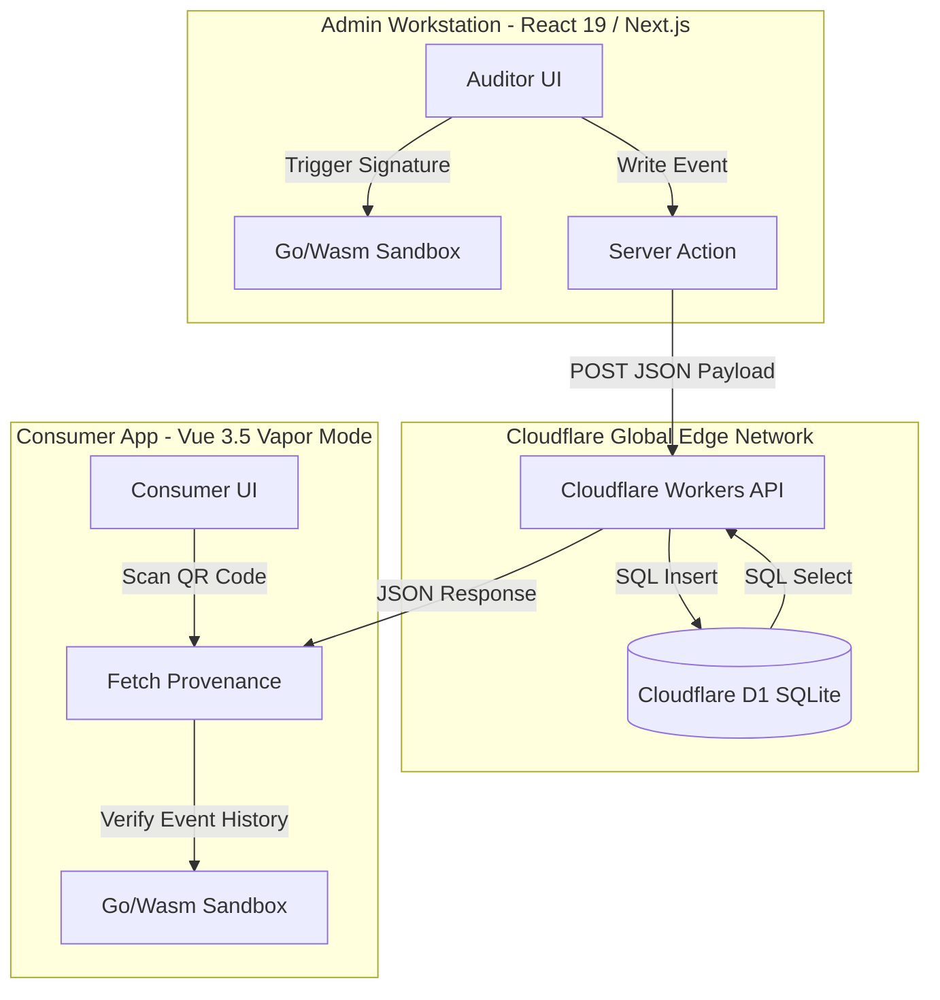
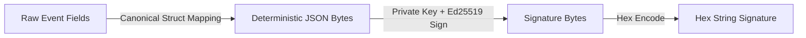
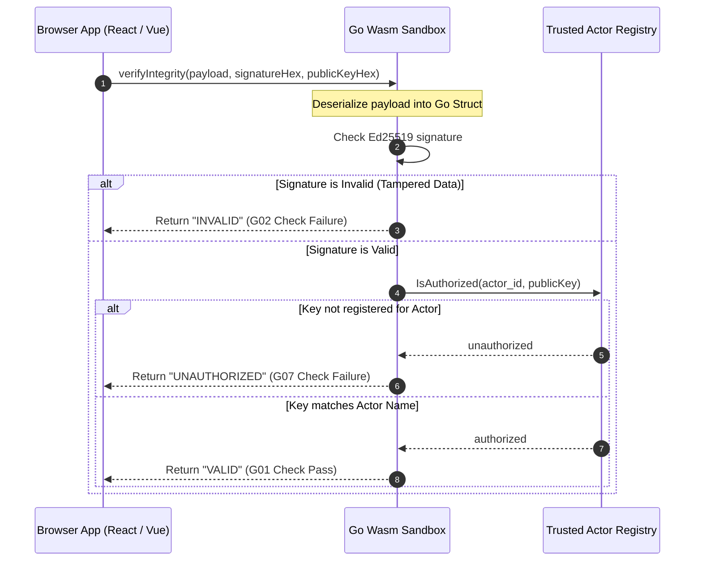
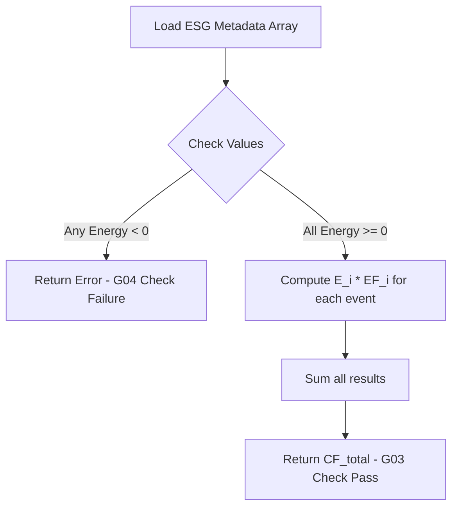

# Architecture & Data Flow Guide

This document maps the end-to-end data flows, cryptographic signature pipelines, and WebAssembly verification architecture for the Eco Trace ecosystem.

---

## 1. End-to-End System Data Flow

Eco Trace separates read-heavy consumer verification from write-heavy administrative operations, running all database interactions at the edge using Cloudflare Workers/Pages and Cloudflare D1.



### The Ingestion and Consumption Pipeline:
1. **Event Capture & Local Signing**:
   - An administrator onboards a new event (e.g., harvesting coffee beans at origin) at the **Admin Workstation**.
   - During seeding or event registration, the payload is signed using the actor's Ed25519 private key.
2. **Edge Storage**:
   - The signed event payload, along with its Hex signature and signer's Hex public key, is sent to the Cloudflare Workers API.
   - The API writes the record into **Cloudflare D1**, the serverless SQLite database replicated across Cloudflare's edge points.
3. **Consumer Lookup**:
   - A consumer scans a QR code on a retail product, triggering the **Vue 3.5 Consumer App** to query the Workers API.
   - The API retrieves the historical chain of custody (lineage) for that specific `asset_id` from D1 and returns it as a JSON array.
4. **Edge-Client Verification**:
   - The Consumer App processes each event through its local client-side **Go/Wasm Engine** instance to mathematically verify the signature and authorize the signer before displaying the information to the user.

---

## 2. Cryptographic Ed25519 Signing Path

To prevent tampering and retroactive database modification (greenwashing), every event payload is signed at the origin by a trusted actor using **Ed25519 cryptography**.

### 2.1 Deterministic Serialization Schema

A signature is only stable if the payload is serialized identically during both signing and verification. JavaScript objects do not guarantee key order, so the Go/Wasm verification engine defines a strict **canonical struct layout**:

```go
type canonicalEvent struct {
	EventID   string            `json:"event_id"`
	AssetID   string            `json:"asset_id"`
	ActorID   string            `json:"actor_id"`
	Timestamp string            `json:"timestamp"`
	Action    types.ActionType  `json:"action_type"`
	ESG       types.ESGMetadata `json:"esg_metadata"`
}
```

This struct serializes into a stable JSON sequence where keys always appear in this exact order:

```json
{
  "event_id": "EVT-COFFEE-001",
  "asset_id": "ASSET-COFFEE-2026-001",
  "actor_id": "Andes Organic Cooperative",
  "timestamp": "2026-06-01T08:00:00Z",
  "action_type": "ORIGIN",
  "esg_metadata": {
    "energy_kwh": 120,
    "emission_factor": 0.2
  }
}
```

### 2.2 Signature Pipeline



1. **Serialize**: Map event properties to the canonical format and serialize to bytes.
2. **Sign**: Pass the serialized JSON bytes and the Actor's Private Key to the Ed25519 signing function.
3. **Hex Code**: Convert the resulting 64-byte signature to a 128-character hexadecimal string for database storage.

---

## 3. WebAssembly Verification Flow

Rather than using standard JavaScript, which is prone to environment inconsistencies, DOM manipulation, or script injections, Eco Trace isolates verification within a **WebAssembly sandbox** running Go compiled to WebAssembly.



### 3.1 Verification Steps in Go/Wasm:

1. **Instantiation**: The front-end dynamically imports `wasm_exec.js` and instantiates `engine.wasm`.
2. **Exposing Functions**: Go's `main()` executes `js.Global().Set("verifyIntegrity", ...)` to register the validator function on `window` and triggers the `__ecotraceOnReady` callback.
3. **Signature Verification**:
   - `VerifyEventHex` decodes the hex signature and public key.
   - It deterministically serializes the event payload using Go's JSON encoder.
   - It performs `ed25519.Verify` against the decoded public key and payload.
4. **Registry Authorization Check**:
   - The engine queries the global `TrustedActors` map using the payload's `actor_id` as the key.
   - If the public key provided does not match the public key registered for that `actor_id` in the Go source code registry, validation returns `UNAUTHORIZED` (preventing actor spoofing).

---

## 4. Deterministic Carbon Math Flow

Sustainability metrics (specifically total carbon footprint emissions) are calculated deterministically inside the Go/Wasm sandbox to prevent UI floating-point errors and verify environmental claims.

The formula computed by `calculateFootprint` is:

$$CF_{total} = \sum_{i=1}^{n} (E_i \times EF_i)$$

Where:
- \(CF_{total}\) is the total Carbon Footprint emissions in kilograms of \(CO_2\) equivalent (\(kgCO_2e\)).
- \(E_i\) is the energy consumed during event \(i\) in kilowatt-hours (\(kWh\)).
- \(EF_i\) is the emission factor for that energy source in \(kgCO_2e/kWh\).



### Constraints Enforced:
- **Non-negativity (G04)**: If any `energy_kwh` value is negative, the calculation immediately fails with an error to prevent negative greenwashing hacks.
- **Float Stability**: The Go math package guarantees bitwise identical precision on both client browser runtimes and server API checks.
