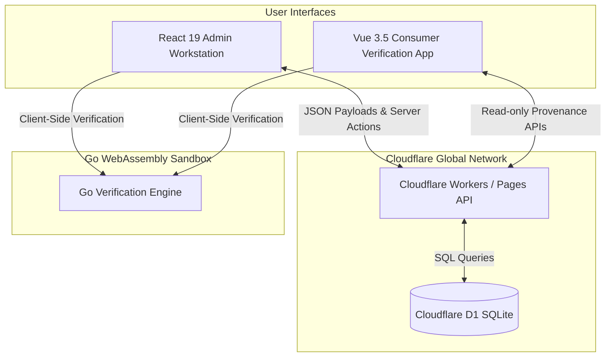
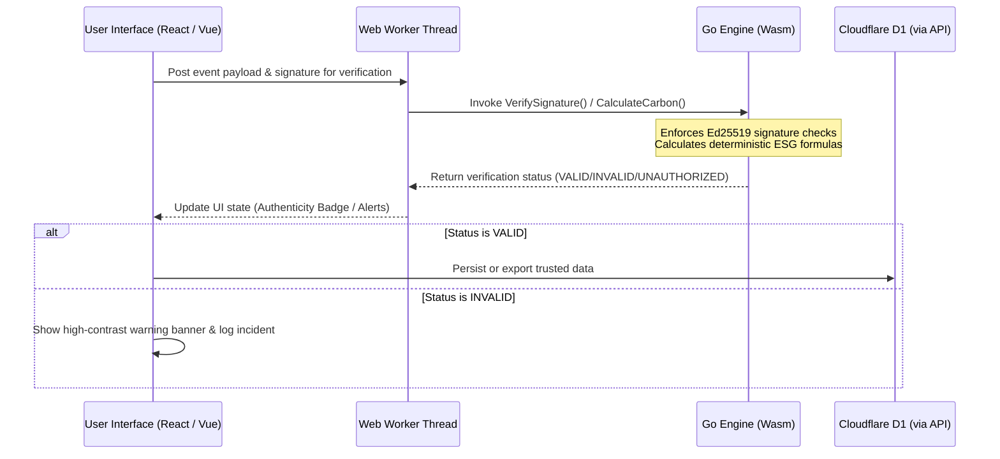

# Architecture Case Study: Cryptographically Verifiable ESG Traceability

## Executive Summary & Business Problem

In the modern enterprise landscape, sustainability and Environmental, Social, and Governance (ESG) claims are under unprecedented scrutiny. Regulatory bodies and consumers alike are demanding transparency. However, traditional ESG tracking systems suffer from three critical flaws:
1. **The Greenwashing Trap**: Sustainability claims are often stored in static PDFs, spreadsheets, or proprietary databases, making them easy to fabricate and hard to verify.
2. **Centralized Vulnerability**: Supply chain databases are susceptible to retroactive tampering, where past events are modified to artificially lower calculated carbon footprints or hide unauthorized suppliers.
3. **High Integration Friction**: Combining multi-tier supply-chain data from diverse global actors (growers, processors, distributors) usually requires complex, slow, and expensive enterprise integrations.

**Eco Trace** resolves these challenges by introducing a **cryptographically verifiable supply-chain architecture**. It turns qualitative environmental claims into deterministic, audit-ready product histories. Every event in a product’s journey is cryptographically signed at the source by a trusted actor using Ed25519 key pairs. The history is immutable, verified at the edge, and instantly accessible to both internal auditors and external consumers.

---

## 1. Multi-Surface System Architecture

Eco Trace is designed around a multi-application topology to strictly separate concerns, optimize performance, and maintain clear security boundaries.

### Why Separate Applications?
Rather than build a single monolithic website, Eco Trace splits the interface into two distinct applications to match the security and runtime requirements of its two primary users:

1. **Admin Workstation (React 19 / Next.js)**:
   - **Target Audience**: Internal corporate auditors and supply-chain administrators.
   - **Access Level**: Write-heavy, authenticated, governed by Role-Based Access Control (RBAC).
   - **Key Functions**: Onboard actors, register SKUs/assets, review integrity violations, and export official compliance evidence.
   - **Architectural Shift**: Built with React 19 and Next.js App Router on Cloudflare Pages, utilizing React Server Components (RSCs) for streaming dashboard analytics and Edge-native Server Actions for database mutations.

2. **Consumer Verification App (Vue 3.5 Vapor Mode)**:
   - **Target Audience**: End consumers scanning products in retail stores.
   - **Access Level**: Read-only, completely unauthenticated, optimized for mobile devices.
   - **Key Functions**: Scan QR codes, view product provenance, verify authenticity, and inspect carbon calculations.
   - **Architectural Shift**: Built with Vue 3.5 Vapor Mode to compile down to ultra-lightweight, virtual-DOM-free vanilla JavaScript, ensuring sub-100ms loading speeds on cellular connections.

---

## 2. Go/WebAssembly Trust Boundary Design

To ensure data integrity, Eco Trace implements a strict **trust boundary** between the user interfaces and the validation logic. Instead of executing sensitive cryptographic and mathematical operations in standard JavaScript, Eco Trace delegates these to a **Go-based engine compiled to WebAssembly (Go/Wasm)**.

### Technical Benefits of Go/Wasm:
- **Single Source of Truth**: The exact same verification and calculation logic runs client-side in the React Admin app, client-side in the Vue Consumer app, and server-side if needed. This eliminates duplication and prevents discrepancies.
- **Client-Side Sandbox Isolation**: WebAssembly runs in a sandboxed execution environment. It is isolated from browser-based cross-site scripting (XSS) or DOM manipulation, preventing unauthorized scripts from hijacking the validation results.
- **Performance**: High-speed cryptographic operations (Ed25519 signature verification) are executed at near-native speeds within the browser.

---

## 3. Technology Stack & Architectural Trade-offs

Building a production-grade edge architecture in 2026 requires balancing performance, security, and developer velocity.

### Architectural Decisions & Trade-offs:

| Decision | Chosen Technology | Trade-offs & Rationale |
| :--- | :--- | :--- |
| **Monorepo Management** | `pnpm` Workspaces + `Turbo` | **Pros**: Sharing design tokens (`@eco-trace/ui`) and type schemas across Next.js and Vue is effortless; caching builds cuts local compiling time. **Cons**: Initial monorepo configuration complexity and strict package dependency matching. |
| **Admin UI Framework** | React 19 + Server Components | **Pros**: Progressive loading via `<Suspense>` streams data to the UI as it finishes executing at the edge. Server Actions eliminate boilerplate API endpoints. **Cons**: Require Next.js build-time configurations (`--webpack` due to PDF client libraries) to maintain compatibility with edge deployment. |
| **Consumer UI Framework** | Vue 3.5 Vapor Mode | **Pros**: Compiles to direct DOM operations without virtual-DOM overhead, achieving WCAG 2.1 AA targets and sub-100ms latency on mobile browsers. **Cons**: Vapor mode is highly performant but limits the use of traditional third-party Vue libraries. |
| **Core Verification** | Go 1.22 compiled to WebAssembly | **Pros**: 100% deterministic arithmetic and secure Ed25519 verification shared across frontends. **Cons**: The `.wasm` binary size (approx. 2MB compiled) requires lazy-loading to avoid delaying the initial HTML paint on slow networks. |
| **Persistence Layer** | Cloudflare D1 (SQLite) | **Pros**: Serverless SQL database persisted directly at Cloudflare's edge locations. Low latency and zero database connection pools to manage. **Cons**: Limited to SQLite's transaction model; not suitable for heavy multi-region transactional write operations. |

---

## 4. Verification & Validation Approach

Eco Trace does not rely on subjective validation. Instead, it enforces a quantitative **Evaluation Framework** to audit the system's cryptographic, mathematical, and accessibility health.

### 4.1 Automated Validation (CI/CD)
The monorepo contains a suite of automated tests checking:
- **Cryptographic Sanity**: Units tests in `packages/engine` verifying signature matches and rejection of tampered payloads.
- **Math Logic**: Verification of the carbon calculation algorithm:
  $$CF_{total} = \sum_{i=1}^{n} (E_i \times EF_i)$$
  Ensuring 100% precision and handling of edge-cases (like negative energy inputs).
- **Accessibility Testing**: Automated contrast checking via the `@eco-trace/ui` validator.

### 4.2 The 10 Golden Test Cases (EFS)
The validation layer guarantees compliance with the following:

1. **G01 (Integrity)**: Valid Ed25519 signature on `SupplyChainEvent` must `PASS`.
2. **G02 (Integrity)**: Modified payload with original signature must return `REJECT (INTEGRITY_VIOLATION)`.
3. **G03 (Math)**: $CF_{total}$ calculation for multiple energy inputs must return an exact match.
4. **G04 (Math)**: Carbon calculation with negative energy values must fail validation.
5. **G05 (Schema)**: Missing `actor_id` in event submission must trigger `REJECT (SCHEMA_NON_COMPLIANCE)`.
6. **G06 (Schema)**: Extra fields in payloads must pass (ensuring forward compatibility).
7. **G07 (Security)**: Event signed by an unauthorized `actor_id` must return `BLOCK (UNAUTHORIZED_ACTOR)`.
8. **G08 (Performance)**: QR scan lookup latency at the edge must be `< 100ms`.
9. **G09 (UI/UX)**: Contrast ratio for integrity warnings must meet WCAG 2.1 AA.
10. **G10 (Audit)**: Log entry must be immutably recorded for rejected events.

---

## 5. Why This Matters in 2026: The Shift to Verification

In 2026, the primary challenge of software engineering is no longer *generating interfaces* or *writing boilerplate APIs*—AI tools have commoditized code generation. Instead, the hard problems are:
- **Trust and Provenance**: With the rise of synthetic data and AI-generated outputs, proving *who* wrote a piece of data and *when* it was created is critical.
- **Deterministic Governance**: Businesses need systems with hard, mathematical boundaries that cannot be bypassed by prompt-injection or AI hallucinations.
- **Edge-First Architectures**: Users expect instantaneous loading. Running compute and databases close to the user is no longer optional.

Eco Trace is a technical blueprint for this shift. It demonstrates how to use **edge runtimes**, **immutable databases**, and **browser-based WebAssembly sandbox execution** to build a system where trust is mathematically guaranteed, not merely promised in marketing copy.

---

## Collaborator Credits

The Eco Trace enterprise architecture was designed and implemented by:
- **h-builds** — Lead Solutions Architect & Admin Workstation Engineer
- **LuismGil** — Lead Consumer Verification App Engineer
- **Antigravity** — Google DeepMind Agentic AI Coding Assistant
